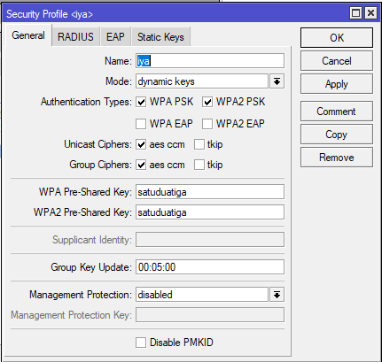
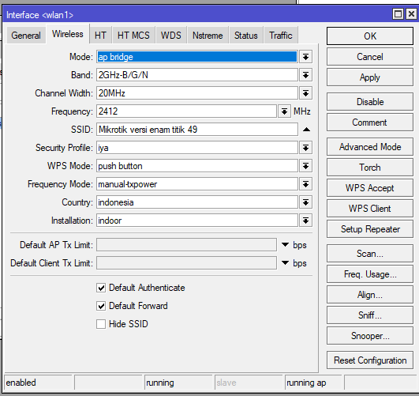
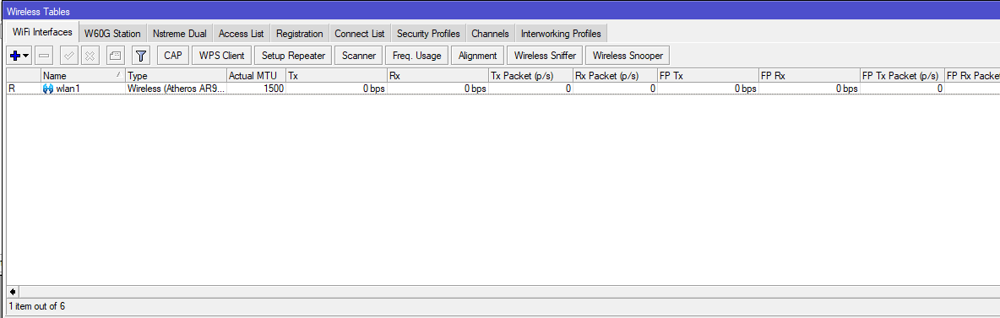
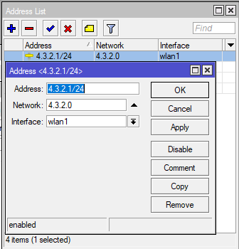

# LAB-34-Point-to-Point-Address
Rabu 20 Agustus 2025
  
# Point to Point Address
  Sekarang kita akan konfigurasi point to point antar RouterBoard dengan menggunakan media wireless pada perangkat Mikrotik. Konsep dasarnya adalah menghubungkan dua Router agar dapat saling terkoneksi melalui jaringan nirkabel. Untuk mendukung konfigurasi tersebut, diperlukan dua RouterBoard, di mana salah satu perangkat dikonfigurasikan sebagai Access Point, sedangkan perangkat lainnya dikonfigurasikan sebagai Client.  

# Konfigurasi PTP di Router 1
  1. Pergi ke **Wireless > Security Profiles**, lalu add, untuk membuat keamanan.
    
  2. Jika sudah, sekarang kita beralih tab ke Interface lalu pilih interface wlannya. **wireless > interface > wlan1**. Ubah modenya menjadi **ap bridge**, SSID nya isi jika ingin custom, dan ganti security profiles menjadi ke security profiles yang kita telah buat sebelumnya.  
    
  3. Setelah itu klik apply dan OK, dan pastikan interface wlan1 tidak disable dan sudah running (R).
    
  4. Sekarang tambahkan IP Address untuk interface wlan1 di **IP > Address > add**.
  
  5. Sampai sini kita sudah selesai mengkonfigurasi router satu menjadi AP.

# Konfigurasi PTP di Router 2

# Kesimpulan
  Selain mengunakan kabel/wired, router juga bisa saling terhubung tanpa kabel/wireless. Router bisa dijadikan AP dan station (client).  
